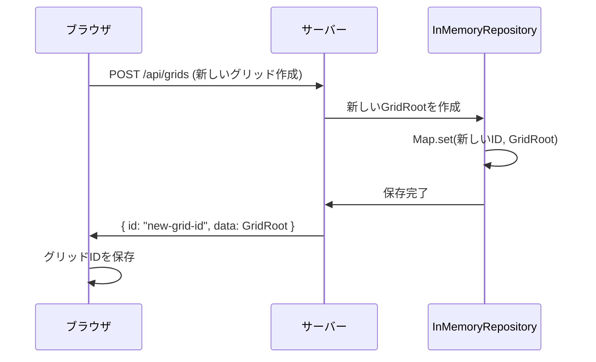
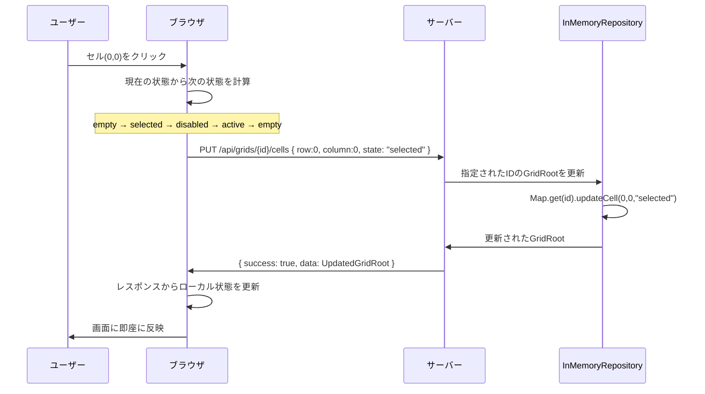
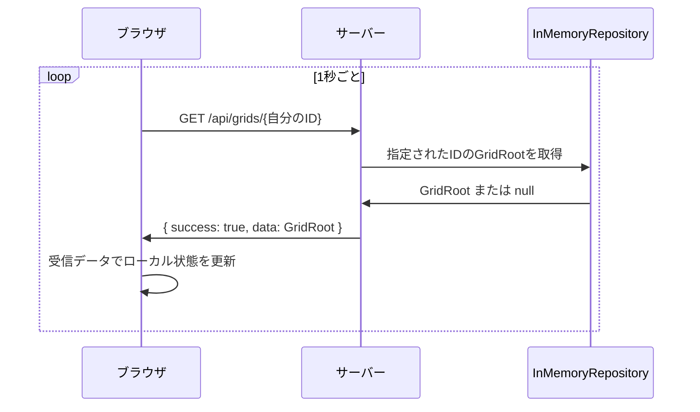

# 現在のアーキテクチャ仕様書

## システム概要

現在のReactパフォーマンステストアプリケーションは、以下のような状態管理とデータ同期の仕様になっています。

## 現在の問題点

⚠️ **複数ブラウザ間での状態同期ができていない**

各ブラウザが独自のグリッドIDを持つため、ブラウザA での変更がブラウザB に反映されません。

## アーキテクチャ図

```
┌─────────────────────────────────────────────────────────────────┐
│                        サーバー側                                  │
│  ┌─────────────────────────────────────────────────────────────┐ │
│  │          InMemoryGridRepository                              │ │
│  │                                                             │ │
│  │  Map<string, GridRoot> _grids                               │ │
│  │  ├─ "grid-id-1" → GridRoot1 (20x20 cells)                  │ │
│  │  ├─ "grid-id-2" → GridRoot2 (20x20 cells)                  │ │
│  │  ├─ "grid-id-3" → GridRoot3 (20x20 cells)                  │ │
│  │  └─ ... (12個のグリッドが存在)                               │ │
│  └─────────────────────────────────────────────────────────────┘ │
│                                ↑                                  │
│                            REST API                               │
│                      (localhost:3001/api)                        │
└─────────────────────────────────────────────────────────────────┘
                                ↑
                          HTTP リクエスト
                                ↑
┌─────────────────────────────────────────────────────────────────┐
│                      クライアント側                                │
│                                                                 │
│  ┌──────────────────┐    ┌──────────────────┐                   │
│  │   ブラウザA        │    │   ブラウザB        │                   │
│  │                  │    │                  │                   │
│  │  React App       │    │  React App       │                   │
│  │  GridID: abc123  │    │  GridID: def456  │  ← 異なるID！     │
│  │                  │    │                  │                   │
│  │  ┌─────────────┐ │    │  ┌─────────────┐ │                   │
│  │  │ 1秒ポーリング │ │    │  │ 1秒ポーリング │ │                   │
│  │  │ GET /grids/ │ │    │  │ GET /grids/ │ │                   │
│  │  │     abc123  │ │    │  │     def456  │ │                   │
│  │  └─────────────┘ │    │  └─────────────┘ │                   │
│  └──────────────────┘    └──────────────────┘                   │
└─────────────────────────────────────────────────────────────────┘
```

## 現在の動作フロー

### 1. ブラウザ起動時


### 2. セルクリック時


### 3. 1秒間隔ポーリング


## 状態管理の詳細

### サーバー側
- **永続化方式**: インメモリ（Map<string, GridRoot>）
- **データ保持期間**: サーバー再起動まで
- **グリッド管理**: 複数のグリッドIDを同時管理
- **状態変更**: APIリクエストごとに即座に反映

### クライアント側
- **状態管理**: React useState（Context/Redux使用なし）
- **データ同期**: 1秒間隔でのポーリング + API応答での即座更新
- **エラー処理**: 各API呼び出しで個別にハンドリング
- **グリッドID**: ブラウザごとに独自のIDを保持

## API エンドポイント

### グリッド管理
```
POST   /api/grids              # 新しいグリッド作成
GET    /api/grids              # 全グリッド取得
GET    /api/grids/{id}         # 特定グリッド取得
DELETE /api/grids/{id}         # グリッド削除
```

### セル操作
```
PUT    /api/grids/{id}/cells           # 単一セル更新
PUT    /api/grids/{id}/rows/{row}      # 行一括更新
PUT    /api/grids/{id}/columns/{col}   # 列一括更新
PUT    /api/grids/{id}/all             # 全セル更新
POST   /api/grids/{id}/reset           # グリッドリセット
```

## セル状態の循環ロジック

```typescript
const getNextCellState = (currentState: CellState): CellState => {
  switch (currentState) {
    case 'empty':    return 'selected';
    case 'selected': return 'disabled';
    case 'disabled': return 'active';
    case 'active':   return 'empty';
    default:         return 'empty';
  }
};
```

## 複数ブラウザ間での非同期の原因

1. **初回グリッド作成**: 各ブラウザが`useEffect(() => createGrid(), [])`で独自のグリッドを作成
2. **異なるグリッドID**: ブラウザA = "abc123"、ブラウザB = "def456" のように別々のID
3. **独立した状態**: 各ブラウザは自分のグリッドIDでのみAPI通信
4. **ポーリング対象**: 自分のグリッドのみを1秒ごとに取得

## 改善が必要な点

### 現在の制限事項
- ✅ サーバー側は正常に状態を保持
- ✅ 各ブラウザ内での状態変更は正常に動作
- ❌ ブラウザ間での状態同期ができない
- ❌ 共有セッションの概念がない

### 解決策の選択肢
1. **共有グリッドID方式**: 全クライアントが同じグリッドIDを使用
2. **WebSocket方式**: リアルタイムでの状態同期
3. **ルーム概念の導入**: 複数ユーザーが同じグリッドを共有

## パフォーマンス特性

### 現在の状態
- **メモリ使用量**: 各グリッド約50KB × グリッド数
- **ポーリング負荷**: 1秒間隔 × クライアント数
- **レスポンス性能**: API応答時間 < 10ms
- **同時接続**: 制限なし（メモリ許容範囲内）

### ボトルネック
- **ポーリング頻度**: 多数のクライアント時に負荷増大
- **メモリ累積**: グリッドが自動削除されない
- **ネットワーク帯域**: 22KB/秒 × クライアント数の定期通信

## まとめ

現在のアーキテクチャは**単一ブラウザ内では正常に動作**しますが、**複数ブラウザ間での状態共有には対応していません**。これは設計上の制限であり、複数ユーザーでの同期が必要な場合は、共有グリッドID方式またはリアルタイム同期機能の追加が必要です。