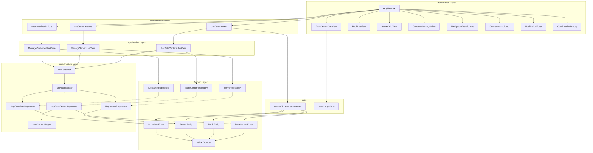
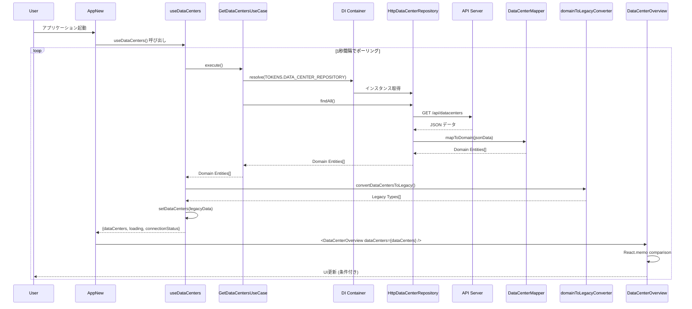
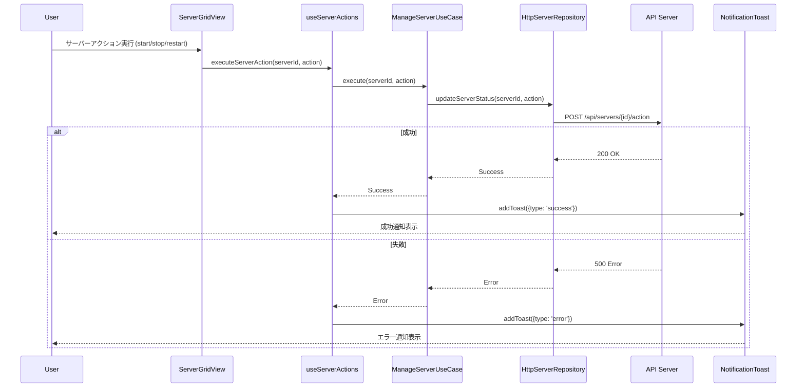
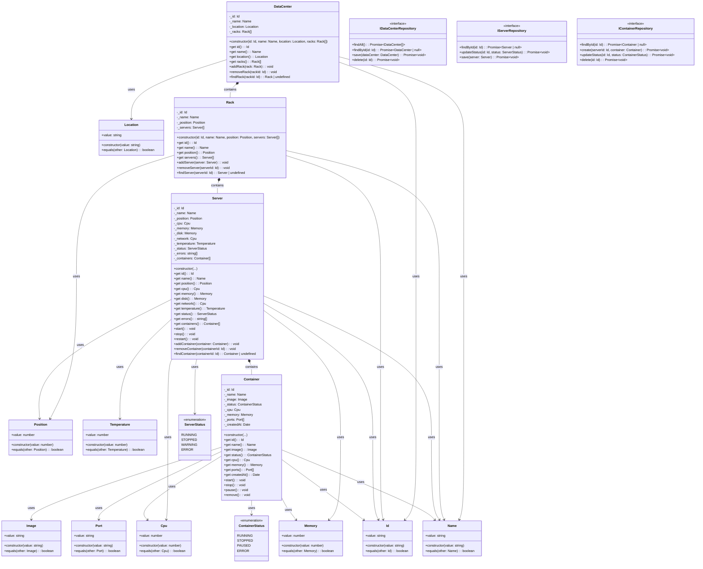

# データセンター監視システム アーキテクチャドキュメント

## 概要

このシステムは、データセンター内のラック、サーバー、コンテナを階層的に監視するリアルタイム監視ダッシュボードです。ドメイン駆動設計（DDD）とレイヤードアーキテクチャを採用し、React Performanceの最適化を実現しています。

## システム構成

### 階層構造
```
データセンター (DataCenter)
├── ラック (Rack)
    ├── サーバー (Server)
        ├── コンテナ (Container)
```

### アーキテクチャレイヤー

#### 1. プレゼンテーション層 (Presentation Layer)
- **責務**: UIコンポーネント、ユーザーインタラクション、状態管理
- **場所**: `src/presentation/`, `src/components/`, `src/AppNew.tsx`

#### 2. アプリケーション層 (Application Layer)
- **責務**: ユースケース、ビジネスロジックの調整
- **場所**: `src/application/use-cases/`

#### 3. ドメイン層 (Domain Layer)
- **責務**: ビジネスルール、エンティティ、値オブジェクト
- **場所**: `src/domain/`

#### 4. インフラストラクチャ層 (Infrastructure Layer)
- **責務**: 外部システムとの通信、データ永続化、依存性注入
- **場所**: `src/infrastructure/`

## コンポーネント依存関係図



## データフローシーケンス図

### データ取得フロー



### ユーザーアクション実行フロー



## ドメイン層クラス図



## React パフォーマンス最適化

### React.memo最適化戦略

1. **構造的比較**: IDやname等の不変プロパティのみを比較
2. **動的値の除外**: CPU、メモリ、温度等の変動値は比較対象外
3. **配列長チェック**: 要素数の変化のみを検知
4. **関数参照比較**: コールバック関数の参照等価性をチェック

### メモ化の実装

```typescript
const areEqual = (prevProps: DataCenterOverviewProps, nextProps: DataCenterOverviewProps) => {
  // 構造的プロパティのみを比較し、動的な数値は無視
  // これにより、データが更新されても構造が同じなら効率的な再描画を実現
}
```

## 依存性注入とサービス管理

### DIコンテナ構成

```typescript
// ServiceRegistry.ts
export const TOKENS = {
  DATA_CENTER_REPOSITORY: Symbol('DataCenterRepository'),
  SERVER_REPOSITORY: Symbol('ServerRepository'),
  CONTAINER_REPOSITORY: Symbol('ContainerRepository'),
  GET_DATA_CENTERS_USE_CASE: Symbol('GetDataCentersUseCase'),
  MANAGE_SERVER_USE_CASE: Symbol('ManageServerUseCase'),
  MANAGE_CONTAINER_USE_CASE: Symbol('ManageContainerUseCase')
};
```

### 依存性逆転の原則

- アプリケーション層とドメイン層は、インフラストラクチャ層に依存しない
- インターフェースを通じた抽象化により、テスタビリティとモジュール性を確保
- DIコンテナによる実行時の依存性解決

## リアルタイム更新メカニズム

### ポーリング戦略
- **間隔**: 1秒
- **接続状態管理**: online/offline/reconnecting
- **確率的状態変更**: 0.998の確率で正常状態を維持

### データ変換フロー
1. **Domain Entities**: ビジネスロジックを含む型安全なエンティティ
2. **Legacy Types**: 既存UIコンポーネントとの互換性を保つ型
3. **Converter**: ドメインエンティティから既存型への変換を担当

## エラーハンドリング

### 多層防御
1. **API層**: HTTPエラーのキャッチとラップ
2. **Repository層**: ドメイン例外への変換
3. **UseCase層**: ビジネスルールの検証
4. **Presentation層**: ユーザーフレンドリーなエラー表示

### 通知システム
- **Toast通知**: 成功/エラーメッセージの表示
- **確認ダイアログ**: 危険な操作の確認
- **接続インジケーター**: リアルタイム接続状態の表示

## まとめ

このアーキテクチャは以下の原則に基づいて設計されています：

1. **関心の分離**: 各層が明確な責務を持つ
2. **依存性逆転**: 抽象に依存し、具象に依存しない
3. **テスタビリティ**: 依存性注入により単体テストが容易
4. **保守性**: ドメインロジックが技術的詳細から分離
5. **パフォーマンス**: React最適化によりスムーズなUI更新

これにより、スケーラブルで保守可能な、高性能なリアルタイム監視システムを実現しています。